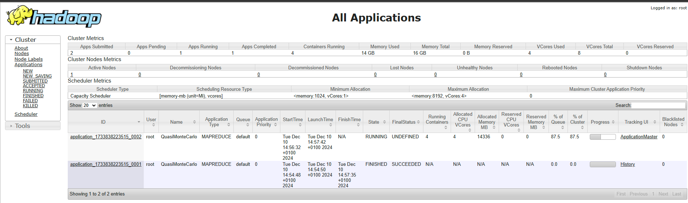

# Lab 2 - Hadoop

## Preparation
### What are the new services ?

Before : 
- namenode
- datanode
- datanode2

Now :
- namenode
- datanode
- resourcemanager
- nodemanager1
- historyserver

### Explain the role of each one
#### Namenode
Le nameNode permet de gérer / manager les blocks présents dans les DatasNodes
#### Datanode
Le DataNode est un noeud qui gère et stocke les données
#### Resourcemanager
Est le noeud principal de notre système, c'est lui qui va gérer les ressources et les jobs. Il réponds aux requêtes des clients.
[](https://hadoop.apache.org/docs/current/hadoop-yarn/hadoop-yarn-site/YARN.html)
#### Nodemanager
Le NodeManager est un démon qui gère les ressources et les containers sur un noeud.
#### Historyserver
Le HistoryServer est un démon qui sert à visualiser les logs des applications qui ont été exécutées sur le cluster.

## Testing your setup
Find full path to the hadoop-mapreduce-examples-3.2.1.jar inside the container : `opt/hadoop-3.2.1/share/hadoop/mapreduce/hadoop-mapreduce-examples-3.2.1.jar`

Use the hadoop command to start the pi example from the jar, with parameters 100 and 10. 
`hadoop jar opt/hadoop-3.2.1/share/hadoop/mapreduce/hadoop-mapreduce-examples-3.2.1.jar pi 100 10`

If everything works correctly, you should see the following
- Some files will be created in HDFS (check the Web UI of the NameNode)
Yes, we can see the files in the HDFS web UI (some files here `/user/root/QuasiMonteCarlo_1733838877776_1194194757/in`)

- An application will be running and visible on the resourcemanager web interface


### What is the semantic of the two parameters ?
The first one is the Number of Maps, the second one is the Number of Samples per Map

### Increase the number of maps with the appropriate parameters and see how it is reflected in the web interface
Nothing special, it takes more time to run the job.

### What are the other examples available from this jar ?
```shell
root@1ea3d03d33f8:/# hadoop jar opt/hadoop-3.2.1/share/hadoop/mapreduce/hadoop-mapreduce-examples-3.2.1.jar
An example program must be given as the first argument.
Valid program names are:
  aggregatewordcount: An Aggregate based map/reduce program that counts the words in the input files.
  aggregatewordhist: An Aggregate based map/reduce program that computes the histogram of the words in the input files.
  bbp: A map/reduce program that uses Bailey-Borwein-Plouffe to compute exact digits of Pi.
  dbcount: An example job that count the pageview counts from a database.
  distbbp: A map/reduce program that uses a BBP-type formula to compute exact bits of Pi.
  grep: A map/reduce program that counts the matches of a regex in the input.
  join: A job that effects a join over sorted, equally partitioned datasets
  multifilewc: A job that counts words from several files.
  pentomino: A map/reduce tile laying program to find solutions to pentomino problems.
  pi: A map/reduce program that estimates Pi using a quasi-Monte Carlo method.
  randomtextwriter: A map/reduce program that writes 10GB of random textual data per node.
  randomwriter: A map/reduce program that writes 10GB of random data per node.
  secondarysort: An example defining a secondary sort to the reduce.
  sort: A map/reduce program that sorts the data written by the random writer.
  sudoku: A sudoku solver.
  teragen: Generate data for the terasort
  terasort: Run the terasort
  teravalidate: Checking results of terasort
  wordcount: A map/reduce program that counts the words in the input files.
  wordmean: A map/reduce program that counts the average length of the words in the input files.
  wordmedian: A map/reduce program that counts the median length of the words in the input files.
  wordstandarddeviation: A map/reduce program that counts the standard deviation of the length of the words in the input files.
```

## Reading from HDFS with simple Mapper and Reducer 

Here is the code :

```java
import org.apache.hadoop.conf.Configuration;
import org.apache.hadoop.fs.Path;
import org.apache.hadoop.io.LongWritable;
import org.apache.hadoop.io.Text;
import org.apache.hadoop.mapreduce.Job;
import org.apache.hadoop.mapreduce.Mapper;
import org.apache.hadoop.mapreduce.Reducer;
import org.apache.hadoop.mapreduce.lib.input.FileInputFormat;
import org.apache.hadoop.mapreduce.lib.output.FileOutputFormat;

import java.io.IOException;
import java.util.ArrayList;
import java.util.List;

public class LineMapper {

    // Mapper Class
    public static class LineMapper extends Mapper<LongWritable, Text, LongWritable, Text> {
        @Override
        protected void map(LongWritable key, Text value, Context context) throws IOException, InterruptedException {
            System.out.println("Mapper: Processing key = " + key + ", value = " + value);
            context.write(key, value);
        }
    }

    // Reducer Class
    public static class LineReducer extends Reducer<LongWritable, Text, LongWritable, Text> {
        @Override
        protected void reduce(LongWritable key, Iterable<Text> values, Context context) throws IOException, InterruptedException {
            System.out.println("Reducer: Processing key = " + key);
            List<String> lines = new ArrayList<>();
            for (Text value : values) {
                System.out.println("Reducer: Adding value = " + value);
                lines.add(value.toString());
            }
            context.write(key, new Text(lines.toString()));
        }
    }

    // Main Method
    public static void main(String[] args) throws Exception {
        if (args.length != 2) {
            System.err.println("Usage: wordcount <input path> <output path>");
            System.exit(-1);
        }

        System.out.println("Starting MapReduce job with input: " + args[0] + ", output: " + args[1]);

        Configuration conf = new Configuration();
        Job job = Job.getInstance(conf, "wordcount");

        job.setJarByClass(LineMapper.class);
        job.setMapperClass(LineMapper.class);
        job.setReducerClass(LineReducer.class);

        job.setOutputKeyClass(LongWritable.class);
        job.setOutputValueClass(Text.class);

        FileInputFormat.addInputPath(job, new Path(args[0]));
        FileOutputFormat.setOutputPath(job, new Path(args[1]));

        System.out.println("Job configuration completed. Submitting job...");
        System.exit(job.waitForCompletion(true) ? 0 : 1);
    }
}
```

### Check that your code produces some result and discuss the content of the files
In the output folder, there are 2 files :
- part-r-00000
- _SUCCESS

The first file contains the result of the map reduce job, it contains the key and the value of the job.
The second file is just a flag to indicate that the job was successful.

### What is the value of the key?
The key is the offset from the beginning of the file. It allow hadoop to know where the data is located in the file, and allow the workers to determine where to start

