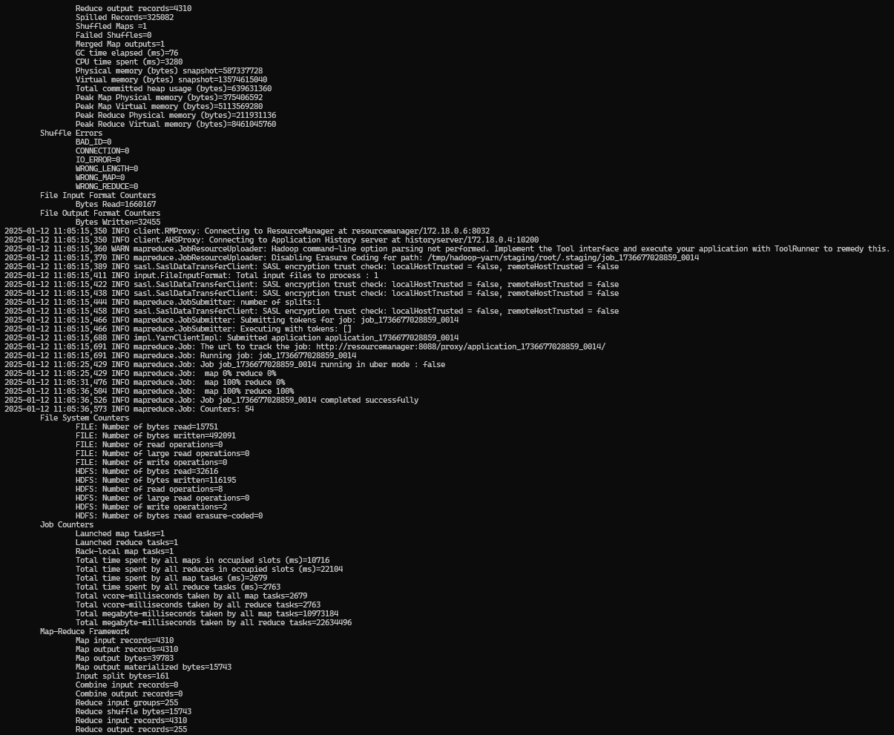

# Hadoop Project

## How to run the project

1. ```docker compose up --build -d```  
It will build and run the docker project. It contains all the hadoop services and the project itself.

2. Build the project  
```mvn clean install```
3. Move the JAR generated into "lab_ressource". This folder is shared with the "ressource_manager".
4. Put all necessary files in the HDFS system (it's mandatory to do that, the default hadoop folder will search in `/user/root` )
```
hdfs dfs -mkdir /user
hdfs dfs -mkdir /user/root
hdfs dfs -mkdir /user/root/input
hdfs dfs -put hadoop/labs/input/* /user/root/input
```
4. Run JAR code inside the ressource_manager
```
docker exec -it resourcemanager bash
hadoop jar hadoop/labs/Hadoop-1.0-SNAPSHOT.jar <class_name> <input_path> <output_path>
```

## Questions

### Count the number of movies by genre
```
hadoop jar hadoop/labs/Hadoop-1.0-SNAPSHOT.jar GenresCounter input/ml-25m/movies.csv output/GenresCounter
hdfs dfs -cat output/GenresCounter/part-r-00000
```


#### FULL RESULT
```
Action  7348
Adventure       4145
Animation       2929
Children        2935
Comedy  16870
Crime   5319
Documentary     5605
Drama   25606
Fantasy 2731
Film-Noir       353
Horror  5989
IMAX    195
Musical 1054
Mystery 2925
Romance 7719
Sci-Fi  3595
Thriller        8654
War     1874
Western 1399
```

### The list of movies for a genre given as an argument of your program 

```
hadoop jar hadoop/labs/Hadoop-1.0-SNAPSHOT.jar MoviesCounterFromSpecificGenre input/ml-25m/movies.csv output/MoviesCounterFromSpecificGenre Film-Noir
hdfs dfs -cat output/MoviesCounterFromSpecificGenre/part-r-00000
```

#### FULL RESULTS


```
Film-Noir       Drive (2011)
Film-Noir       Aerial, The (La antena) (2007)
Film-Noir       Big Clock, The (1948)
Film-Noir       In a Lonely Place (1950)
Film-Noir       Armored Car Robbery (1950)
Film-Noir       Sweet Smell of Success (1957)
Film-Noir       The Face Behind the Mask (1941)
Film-Noir       Postman Always Rings Twice, The (1946)
Film-Noir       Unsuspected, The (1947)
Film-Noir       Private Hell 36 (1954)
Film-Noir       Long Goodbye, The (1973)
Film-Noir       Walk a Crooked Mile (1948)
Film-Noir       Devil in a Blue Dress (1995)
Film-Noir       Laura (1944)
Film-Noir       Night Train to Munich (1941)
Film-Noir       Double Life, A (1947)
Film-Noir       Big Steal, The (1949)
Film-Noir       Tulse Luper Suitcases, Part 1: The Moab Story, The (2003)
Film-Noir       Lady in the Lake (1947)
Film-Noir       Verdict, The (1946)
Film-Noir       Ministry of Fear (1944)
Film-Noir       Bitter Moon (1992)
Film-Noir       New Orleans Uncensored (1955)
Film-Noir       No Way Out (1950)
Film-Noir       House of Games (1987)
Film-Noir       Crossfire (1947)
Film-Noir       Beyond the Forest (1949)
Film-Noir       Black Hand (1950)
Film-Noir       Yesterday Was a Lie (2008)
Film-Noir       Ride the Pink Horse (1947)
Film-Noir       New York Confidential (1955)
Film-Noir       Pale Flower (Kawaita hana) (1964)
Film-Noir       Foreign Correspondent (1940)
Film-Noir       Mask of Dimitrios, The (1944)
Film-Noir       House on 92nd Street, The (1945)
Film-Noir       This World, Then the Fireworks (1997)
Film-Noir       Stranger, The (1946)
Film-Noir       Pickup on South Street (1953)
Film-Noir       Dark Corner, The (1946)
Film-Noir       Naked City, The (1948)
Film-Noir       Brothers Rico, The (1957)
Film-Noir       Killing, The (1956)
Film-Noir       Third Man, The (1949)
Film-Noir       House of Bamboo (1955)
Film-Noir       Slander (1957)
Film-Noir       Second Woman, The (1950)
Film-Noir       99 River Street (1953)
Film-Noir       His Kind of Woman (1951)
Film-Noir       Drunken Angel (Yoidore tenshi) (1948)
Film-Noir       Johnny Eager (1942)
Film-Noir       Racket, The (1951)
Film-Noir       Johnny Allegro (1949)
Film-Noir       Escape in the Fog (1945)
Film-Noir       Gun Crazy (a.k.a. Deadly Is the Female) (1949)
Film-Noir       Boomerang (1947)
Film-Noir       Journey Into Fear (1943)
Film-Noir       Angel Face (1952)
Film-Noir       Johnny Apollo (1940)
Film-Noir       Moontide (1942)
Film-Noir       I Became a Criminal (They Made Me a Fugitive) (1947)
Film-Noir       Phenix City Story, The (1955)
Film-Noir       Dot the I (2003)
Film-Noir       Edge of the City (1957)
Film-Noir       Big Sleep, The (1946)
Film-Noir       Possessed (1947)
Film-Noir       Fallen Angel (1945)
Film-Noir       Pure Formality, A (Pura formalità, Una) (1994)
Film-Noir       Killers, The (1946)
Film-Noir       Suddenly (1954)
Film-Noir       Christmas Holiday (1944)
Film-Noir       Nightfall (1957)
Film-Noir       One False Move (1992)
Film-Noir       Side Street (1949)
Film-Noir       Secret Beyond the Door (1948)
Film-Noir       Crime Wave (1954)
Film-Noir       It Happened at the Inn (Goupi mains rouges) (1943)
Film-Noir       While the City Sleeps (1956)
Film-Noir       Allotment Wives (1945)
Film-Noir       Berlin Express (1948)
Film-Noir       House of Numbers (1957)
Film-Noir       Border Incident (1949)
Film-Noir       Party Girl (1958)
Film-Noir       Decoy (1946)
Film-Noir       Crime of Passion (1958)
Film-Noir       Out of the Fog (1941)
Film-Noir       Suture (1993)
Film-Noir       Renaissance (2006)
Film-Noir       Limits of Control, The (2009)
Film-Noir       House on Telegraph Hill, The (1951)
Film-Noir       Dark Passage (1947)
Film-Noir       Set-Up, The (1949)
Film-Noir       Dark City (1998)
Film-Noir       Dark City (1950)
Film-Noir       Hickey and Boggs (1972)
Film-Noir       Fingers at the Window (1942)
Film-Noir       Mystery Street (1950)
Film-Noir       Deception (1946)
Film-Noir       Bribe, The (1949)
Film-Noir       Angel Heart (1987)
Film-Noir       Sudden Fear (1952)
Film-Noir       Detective Story (1951)
Film-Noir       Crack-Up (1946)
Film-Noir       Brighton Rock (1947)
Film-Noir       Chase a Crooked Shadow (1958)
Film-Noir       Body and Soul (1947)
Film-Noir       13th Letter, The (1951)
Film-Noir       Caught (1949)
Film-Noir       Hoodlum (1997)
Film-Noir       Great Flamarion, The (1945)
Film-Noir       5 Against the House (1955)
Film-Noir       Prowler, The (1951)
Film-Noir       Hitch-Hiker, The (1953)
Film-Noir       House by the River (1950)
Film-Noir       Born to Kill (1947)
Film-Noir       Dark Mirror, The (1946)
Film-Noir       Framed (1947)
Film-Noir       Desperate Hours, The (1955)
Film-Noir       Walk Softly, Stranger (1950)
Film-Noir       Whirlpool (1949)
Film-Noir       13 Tzameti (2005)
Film-Noir       Stranger on the Third Floor (1940)
Film-Noir       The Devil Thumbs a Ride (1947)
Film-Noir       Drive a Crooked Road (1954)
Film-Noir       Danger Signal (1945)
Film-Noir       2 Days in the Valley (1996)
Film-Noir       Rubber (2010)
Film-Noir       Rogues' Regiment (1948)
Film-Noir       Killing of a Chinese Bookie, The (1976)
Film-Noir       Woman on the Run (1950)
Film-Noir       Night of the Hunter, The (1955)
Film-Noir       Appointment with Danger (1951)
Film-Noir       Suspicion (1941)
Film-Noir       Vice (2008)
Film-Noir       Blonde Ice (1948)
Film-Noir       Classe Tous Risques (Big Risk, The) (1960)
Film-Noir       Lady from Shanghai, The (1947)
Film-Noir       My Name Is Julia Ross (1945)
Film-Noir       Blue Dahlia, The (1946)
Film-Noir       Clash by Night (1952)
Film-Noir       Where the Sidewalk Ends (1950)
Film-Noir       Big Night, The (1951)
Film-Noir       Big Knife, The (1955)
Film-Noir       Street with No Name, The (1948)
Film-Noir       Dillinger (1945)
Film-Noir       Kiss of Death (1947)
Film-Noir       Sound of Fury, The (1950)
Film-Noir       Dead End (1937)
Film-Noir       Lady Without Passport, A (1950)
Film-Noir       Murder is My Beat (1955)
Film-Noir       Brainstorm (1965)
Film-Noir       Pitfall (1948)
Film-Noir       No Questions Asked (1951)
Film-Noir       Singapore (1947)
Film-Noir       File on Thelma Jordan, The (1950)
Film-Noir       The Thief (1952)
Film-Noir       They Won't Believe Me (1947)
Film-Noir       M (1951)
Film-Noir       Fury (1936)
Film-Noir       Cornered (1945)
Film-Noir       Hollow Triumph (a.k.a. The Scar) (1948)
Film-Noir       Marked Woman (1937)
Film-Noir       Unfaithful, The (1947)
Film-Noir       Harder They Fall, The (1956)
Film-Noir       14 Hours (Fourteen Hours) (1951)
Film-Noir       Champion (1949)
Film-Noir       Angels with Dirty Faces (1938)
Film-Noir       Port of New York (1949)
Film-Noir       Brute Force (1947)
Film-Noir       Frightened City, The (1961)
Film-Noir       Affair in Trinidad (1952)
Film-Noir       Road House (1948)
Film-Noir       The Bloody Olive (1997)
Film-Noir       Scarlet Street (1945)
Film-Noir       Rogue Cop (1954)
Film-Noir       No Man of Her Own (1950)
Film-Noir       Grifters, The (1990)
Film-Noir       Where Danger Lives (1950)
Film-Noir       He Walked by Night (1948)
Film-Noir       Murder, My Sweet (1944)
Film-Noir       Window, The (1949)
Film-Noir       Railroaded! (1947)
Film-Noir       Backfire (1950)
Film-Noir       Raw Deal (1948)
Film-Noir       The Crooked Way (1949)
Film-Noir       Letter, The (1940)
Film-Noir       Maltese Falcon, The (1941)
Film-Noir       Driver, The (1978)
Film-Noir       I Am a Fugitive from a Chain Gang (1932)
Film-Noir       Shanghai Gesture, The (1941)
Film-Noir       Cause for Alarm! (1951)
Film-Noir       Flaxy Martin (1949)
Film-Noir       Assassin Next Door, The (Kirot) (2009)
Film-Noir       Undercurrent (1946)
Film-Noir       Night Court (1932)
Film-Noir       The Dark Past (1948)
Film-Noir       Woman on the Beach, The (1947)
Film-Noir       High Sierra (1941)
Film-Noir       Lady on a Train (1945)
Film-Noir       I Was A Communist for the FBI (1951)
Film-Noir       Force of Evil (1948)
Film-Noir       Breaking Point, The (1950)
Film-Noir       Notorious (1946)
Film-Noir       Touch of Evil (1958)
Film-Noir       Miller's Crossing (1990)
Film-Noir       Guest in the House (1944)
Film-Noir       Singapore Sling (Singapore sling: O anthropos pou agapise ena ptoma) (1990)
Film-Noir       Shield for Murder (1954)
Film-Noir       Fallen Sparrow, The (1943)
Film-Noir       Frogs for Snakes (1998)
Film-Noir       White Heat (1949)
Film-Noir       Dial 1119 (1950)
Film-Noir       Brick (2005)
Film-Noir       Stray Dog (Nora inu) (1949)
Film-Noir       Lineup, The (1958)
Film-Noir       Terribly Happy (Frygtelig lykkelig) (2008)
Film-Noir       Detour (1945)
Film-Noir       Cry Terror! (1958)
Film-Noir       Desperate (1947)
Film-Noir       Brasher Doubloon, The (1947)
Film-Noir       Sunset Blvd. (a.k.a. Sunset Boulevard) (1950)
Film-Noir       Strange Love of Martha Ivers, The (1946)
Film-Noir       Mildred Pierce (1945)
Film-Noir       Panic in the Streets (1950)
Film-Noir       This Side of the Law (1950)
Film-Noir       Under the Gun (1951)
Film-Noir       Blues in the Night (1941)
Film-Noir       Shockproof (1949)
Film-Noir       Night and the City (1950)
Film-Noir       Racket, The (1928)
Film-Noir       Glass Web, The (1953)
Film-Noir       Big Combo, The (1955)
Film-Noir       The Amazing Dr. Clitterhouse (1938)
Film-Noir       Kiss Me Deadly (1955)
Film-Noir       Sniper, The (1952)
Film-Noir       White Rose, The (Weiße Rose, Die) (1982)
Film-Noir       Split Second (1953)
Film-Noir       Blue Gardenia, The (1953)
Film-Noir       Two Mrs. Carrolls, The (1947)
Film-Noir       Knock on Any Door (1949)
Film-Noir       Too Late for Tears (1949)
Film-Noir       Pushover (1954)
Film-Noir       Dead Reckoning (1947)
Film-Noir       Leave Her to Heaven (1945)
Film-Noir       Double Indemnity (1944)
Film-Noir       Sin City (2005)
Film-Noir       The Reckless Moment (1949)
Film-Noir       He Ran All the Way (1951)
Film-Noir       Rififi (Du rififi chez les hommes) (1955)
Film-Noir       D.O.A. (1988)
Film-Noir       L.A. Confidential (1997)
Film-Noir       Mulholland Drive (2001)
Film-Noir       This Gun for Hire (1942)
Film-Noir       Phantom Lady (1944)
Film-Noir       Bullet for Joey, A (1955)
Film-Noir       Bewitched (Alter Ego) (1945)
Film-Noir       Chinatown (1974)
Film-Noir       Call Northside 777 (1948)
Film-Noir       Undercover Man (1949)
Film-Noir       Beware, My Lovely (1952)
Film-Noir       Woman's Secret, A (1949)
Film-Noir       You Only Live Once (1937)
Film-Noir       Wrong Man, The (1956)
Film-Noir       On Dangerous Ground (1952)
Film-Noir       Born to Be Bad (1950)
Film-Noir       Union Station (1950)
Film-Noir       Calcutta (1947)
Film-Noir       Las Vegas Story, The (1952)
Film-Noir       I Wake Up Screaming (1941)
Film-Noir       Shock (1946)
Film-Noir       Narrow Margin, The (1952)
Film-Noir       M (1931)
Film-Noir       Bluebeard (1944)
Film-Noir       Big Heat, The (1953)
Film-Noir       Underworld (1927)
Film-Noir       Criss Cross (1949)
Film-Noir       They Live by Night (1949)
Film-Noir       Trou, Le (Hole, The) (Night Watch, The) (1960)
Film-Noir       Buried Alive (1990)
Film-Noir       Alligator Eyes (1990)
Film-Noir       The Beast of the City (1932)
Film-Noir       Killers, The (1964)
Film-Noir       Second Wind (Le deuxième souffle) (Second Breath) (1966)
Film-Noir       The Florentine Dagger (1935)
Film-Noir       Long Night, The (1947)
Film-Noir       Act of Violence (1948)
Film-Noir       Lonelyhearts (1958)
Film-Noir       Gilda (1946)
Film-Noir       Woman in the Window, The (1944)
Film-Noir       House of Strangers (1949)
Film-Noir       Illegal (1955)
Film-Noir       Odd Man Out (1947)
Film-Noir       Somewhere in the Night (1946)
Film-Noir       Johnny Angel (1945)
Film-Noir       Scandal Sheet (1952)
Film-Noir       Sleep, My Love (1948)
Film-Noir       Beyond a Reasonable Doubt (1956)
Film-Noir       T-Men (1947)
Film-Noir       Between Midnight and Dawn (Prowl Car) (1950)
Film-Noir       Blueprint for Murder, A (1953)
Film-Noir       Paid (1930)
Film-Noir       Strip, The (1951)
Film-Noir       Act of Murder, An (Live Today for Tomorrow) (1948)
Film-Noir       Murder by Contract (1958)
Film-Noir       Man Between, The (1953)
Film-Noir       Asphalt Jungle, The (1950)
Film-Noir       Tight Spot (1955)
Film-Noir       Lured (1947)
Film-Noir       Killer's Kiss (1955)
Film-Noir       Sorry, Wrong Number (1948)
Film-Noir       Tinker Tailor Soldier Spy (2011)
Film-Noir       The Well (1951)
Film-Noir       Witness to Murder (1954)
Film-Noir       Crossroads (1942)
Film-Noir       Deadline at Dawn (1946)
Film-Noir       Vares: The Kiss of Evil (Vares - Pahan suudelma) (2011)
Film-Noir       Single Shot, A (2013)
Film-Noir       Strangers on a Train (1951)
Film-Noir       Cry in the Night, A (1956)
Film-Noir       Bullet to the Head (2012)
Film-Noir       Moonrise (1948)
Film-Noir       Thieves' Highway (1949)
Film-Noir       Dangerous Profession, A (1949)
Film-Noir       Follow Me Quietly (1949)
Film-Noir       Nightmare Alley (1947)
Film-Noir       Seventh Victim, The (1943)
Film-Noir       Blood Simple (1984)
Film-Noir       Nobody Lives Forever (1946)
Film-Noir       Enforcer, The (1951)
Film-Noir       Wicked Woman (1953)
Film-Noir       Glass Key, The (1942)
Film-Noir       Night Has a Thousand Eyes (1948)
Film-Noir       Human Desire (1954)
Film-Noir       Mob, The (1951)
Film-Noir       Radioactive Dreams (1985)
Film-Noir       Kansas City Confidential (1952)
Film-Noir       Kiss Before Dying, A (1956)
Film-Noir       Jeopardy (a.k.a. A Woman in Jeopardy) (1953)
Film-Noir       Key Largo (1948)
Film-Noir       High and Low (Tengoku to jigoku) (1963)
Film-Noir       City Streets (1931)
Film-Noir       Killer Is Loose, The (1956)
Film-Noir       Signal, The (Señal, La) (2007)
Film-Noir       Down by Law (1986)
Film-Noir       711 Ocean Drive (1950)
Film-Noir       The Arnelo Affair (1947)
Film-Noir       Tension (1949)
Film-Noir       Counterfeit Coin, The (Istoria mias kalpikis liras) (1955)
Film-Noir       Conflict (1945)
Film-Noir       Out of the Past (1947)
Film-Noir       Black Angel (1946)
Film-Noir       Lost Highway (1997)
Film-Noir       Missing Person, The (2009)
Film-Noir       D.O.A. (1950)
```

### The average score per userID

```
hadoop jar hadoop/labs/Hadoop-1.0-SNAPSHOT.jar AvgScorePerUserId input/ml-25m/ratings.csv output/AvgScorePerUserId
hdfs dfs -cat output/AvgScorePerUserId/part-r-00000
```
#### EXECUTION


#### RESULTS EXTRACT


### The average score per movieID

```
hadoop jar hadoop/labs/Hadoop-1.0-SNAPSHOT.jar AvgScorePerMovieId input/ml-25m/ratings.csv output/AvgScorePerMovieId
hdfs dfs -cat output/AvgScorePerMovieId/part-r-00000
```

#### EXECUTION

#### RESULTS EXTRACT


### The highest rated movieID per user

```
hadoop jar hadoop/labs/Hadoop-1.0-SNAPSHOT.jar HMovieRatedPerUser input/ml-25m/ratings.csv output/HMovieRatedPerUser
hdfs dfs -cat output/HMovieRatedPerUser/part-r-00000
```

#### EXECUTION


#### RESULTS EXTRACT


### Find the name of the highest rated movie per userID

It contains one mapper / one reducer and a setup. The setup is here to map the id with the name, it initiate the reducer job. 

```
hadoop jar hadoop/labs/Hadoop-1.0-SNAPSHOT.jar HMovieNameRatedPerUser input/ml-25m/ratings.csv input/ml-25m/movies.csv output/HMovieNameRatedPerUser
hdfs dfs -cat output/HMovieNameRatedPerUser/part-r-00000
```

#### EXECUTION


#### RESULTS EXTRACT


### Count likes per film + group by like count

It contains 3 jobs :
- First job (Extract the most rated movies per user) :
  - Map datas like this : userId, movieId
  - Choose the highest rated filmId -> only one film per user
- Second job (Compute the number of likes per film)
  - Map datas like this : movieId, 1
  - Compute the number of one to set : movieId, X
- Last job (Compute and regroup films to sort by popularity (most liked))
  - Sort the movies by popularity (most likes)
  - Add the films with the same number of likes on the same line

```
hadoop jar hadoop/labs/Hadoop-1.0-SNAPSHOT.jar LikesPerMoviesName input/ml-25m/ratings.csv input/ml-25m/movies.csv output/LikesPerMoviesName
hdfs dfs -cat output/LikesPerMoviesName/output/part-r-00000
```

#### EXECUTION EXTRACT



#### RESULTS EXTRACT


